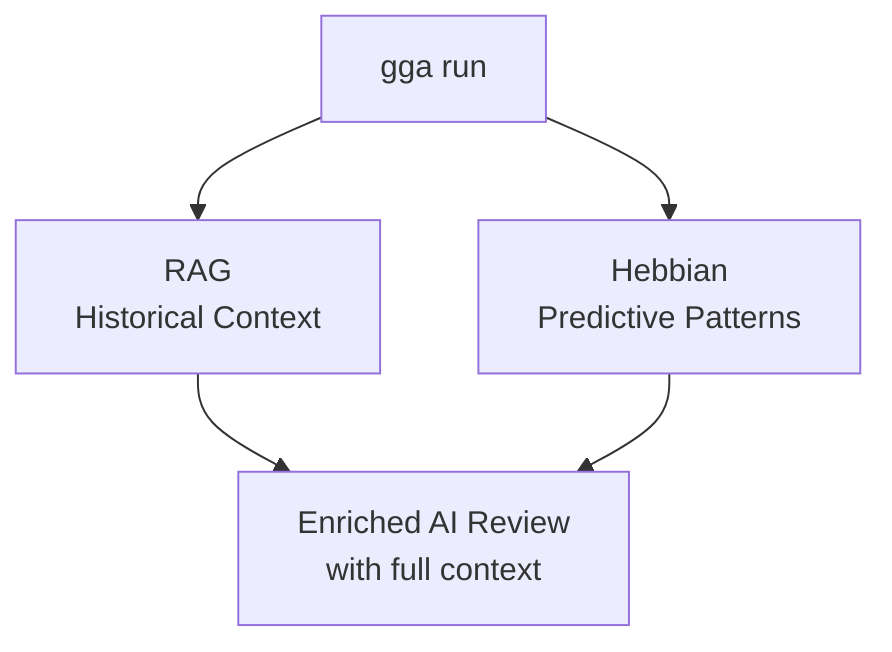
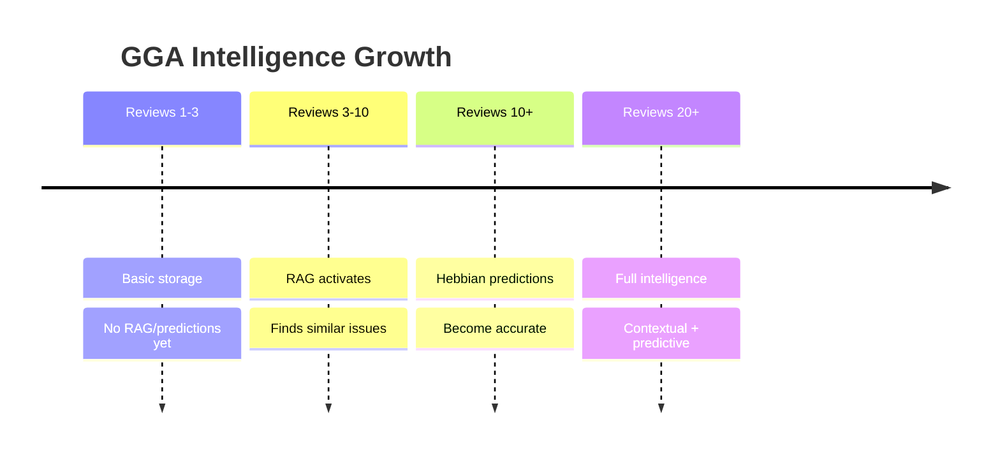

# Context-Aware Reviews

## Overview

GGA provides **intelligent, context-aware code reviews** that automatically leverage your project's history. Every time you run `gga run`, two systems work together behind the scenes:



**You don't need to do anything special** - these features activate automatically as you use GGA.

---

## What Happens Automatically

### 1. RAG: Historical Context Injection

When you run a review, GGA automatically:

1. **Analyzes** your current code changes
2. **Searches** your review history for similar past issues
3. **Injects** relevant context into the AI prompt

```
WITHOUT RAG:
  AI sees: "Your code changes"
  AI says: "SQL injection vulnerability detected"

WITH RAG (automatic):
  AI sees: "Your code changes" + "3 similar past reviews"
  AI says: "SQL injection vulnerability detected. This is similar to
            the issue in review #34 from Jan 15 in src/users.ts.
            The fix was using prepared statements with $1, $2 placeholders.
            See commit abc123 for reference."
```

### 2. Hebbian: Pattern Learning

Every review teaches GGA about your project:

1. **Extracts** concepts from code (patterns, files, errors)
2. **Associates** concepts that appear together
3. **Strengthens** frequently co-occurring patterns
4. **Predicts** likely issues based on learned associations

```
After 20 reviews, GGA learns:
  auth.ts changes → 89% associated with security issues
  database code   → 73% associated with validation needs
  api endpoints   → 65% associated with error handling

This knowledge enriches future reviews automatically.
```

---

## User Experience

### The Only Commands You Need

| Command | What It Does |
|---------|--------------|
| `gga run` | Review with full automatic intelligence |
| `gga ask "question"` | Query your project history |
| `gga history` | View past reviews |

That's it. Everything else happens automatically.

### Example Session

```bash
# Make some code changes
git add src/auth/login.ts

# Run review - RAG and Hebbian work automatically
$ gga run

ℹ️  RAG: enabled (5 relevant reviews found)
ℹ️  Hebbian: 3 pattern predictions active

╭──────────────────────────────────────────────╮
│              CODE REVIEW                      │
├──────────────────────────────────────────────┤
│ Status: NEEDS_ATTENTION                       │
│                                              │
│ Findings:                                    │
│ 1. JWT token validation missing signature    │
│    check. Similar issue found in review #34  │
│    (Jan 15) - fixed with jwt.verify().       │
│                                              │
│ 2. Based on project patterns, auth changes   │
│    often require input validation (87%       │
│    historical correlation).                  │
╰──────────────────────────────────────────────╯
```

### Ask Questions About Your History

```bash
$ gga ask "what security issues have we had?"

Based on your review history:

1. JWT validation missing (review #34, #41)
   - Files: auth.ts, middleware/jwt.ts
   - Fix: Use jwt.verify() with secret

2. SQL injection (review #28)
   - Files: users.ts, queries.ts
   - Fix: Prepared statements

3. XSS in user input (review #15)
   - Files: comments.tsx
   - Fix: Sanitize with DOMPurify
```

---

## How It Builds Knowledge

### Learning Curve



### What Gets Learned

| From | GGA Learns |
|------|------------|
| Files reviewed | Which files are related |
| Patterns detected | auth, security, database, api, validation, error |
| Review outcomes | PASSED/FAILED correlations |
| Co-occurrences | "auth + security" appear together often |

### Automatic Decay

Old patterns fade naturally:
- Recent reviews: High influence
- Old reviews: Gradually less relevant
- Unused patterns: Eventually forgotten

This keeps the system current with your evolving codebase.

---

## Configuration

### Disable Automatic Features

If needed, you can disable either system:

```bash
# Disable RAG (no historical context)
export GGA_RAG_ENABLED=false

# Disable Hebbian (no pattern learning)
export GGA_HEBBIAN_ENABLED=false

# Or disable RAG for a single review
gga run --no-rag
```

### Tune Behavior

```bash
# In .gga or ~/.config/gga/config

# RAG: How many past reviews to include
GGA_RAG_CONTEXT_LIMIT=5          # Default: 5

# RAG: Minimum similarity to include
GGA_RAG_MIN_SIMILARITY=0.3       # Default: 0.3

# Hebbian: How fast to learn new patterns
GGA_HEBBIAN_LEARNING_RATE=0.1    # Default: 0.1

# Hebbian: How fast to forget old patterns
GGA_HEBBIAN_DECAY_RATE=0.99      # Default: 0.99
```

---

## Requirements

### Minimum History

| Feature | Requires |
|---------|----------|
| RAG | 3+ reviews stored |
| Hebbian predictions | 10+ reviews for accuracy |

### Build History Quickly

```bash
# Install pre-commit hook for automatic reviews
gga install

# Or review your recent commits
git log --oneline -10  # Find recent commits
gga run                # Review current changes
```

---

## Privacy

All intelligence is **local**:

- Review history stored in `~/.gga/gga.db`
- Patterns learned locally
- No data sent to external servers (except AI provider for review)

---

## Troubleshooting

### "RAG: disabled (insufficient history)"

You need at least 3 reviews. Run more reviews:

```bash
gga run  # Do this a few times
```

### "No predictions available"

Hebbian needs more data. After ~10 reviews, predictions activate.

### Reviews seem generic

Check RAG is finding relevant context:

```bash
GGA_DEBUG=1 gga run 2>&1 | grep -i rag
```

---

## Summary

| Feature | What | When | User Action |
|---------|------|------|-------------|
| **RAG** | Adds historical context | Every `gga run` | None (automatic) |
| **Hebbian** | Learns & predicts patterns | Every `gga run` | None (automatic) |
| **Ask** | Query history | `gga ask` | Ask questions |

**The intelligence grows automatically as you use GGA.** Just keep running reviews and the system gets smarter about your specific project.
