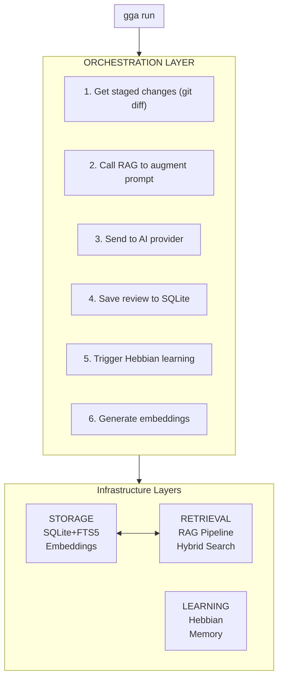
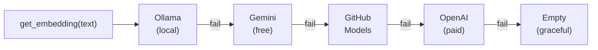
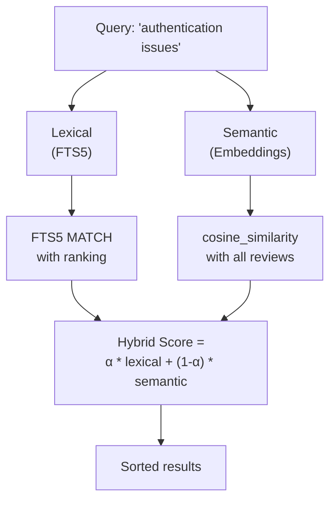
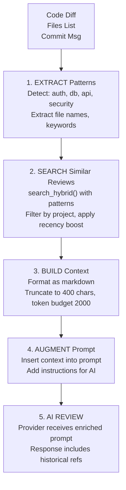
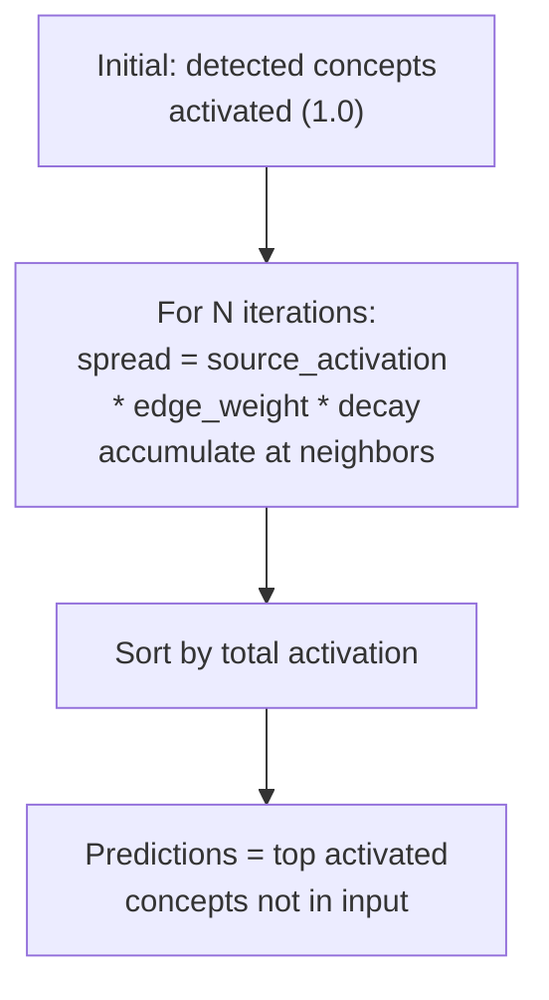
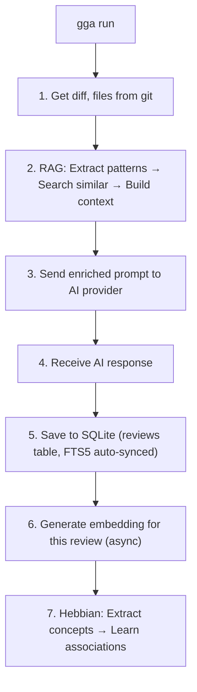

# Internal Architecture

> This document explains how GGA's intelligence works under the hood. **You don't need to read this to use GGA** - it's for developers who want to understand or contribute to the system.

---

## System Overview



---

## Layer 1: Storage (SQLite + FTS5)

### Purpose
Persist all reviews with full-text search capability.

### Schema

```sql
-- Main reviews table
CREATE TABLE reviews (
    id INTEGER PRIMARY KEY AUTOINCREMENT,
    created_at TEXT NOT NULL DEFAULT (datetime('now')),
    project_path TEXT NOT NULL,
    project_name TEXT NOT NULL,
    git_branch TEXT,
    git_commit TEXT,
    files TEXT NOT NULL,              -- Comma-separated
    files_count INTEGER NOT NULL,
    diff_content TEXT,                -- Full diff
    diff_hash TEXT,                   -- MD5 for deduplication
    result TEXT NOT NULL,             -- AI response
    status TEXT NOT NULL,             -- PASSED|FAILED|ERROR
    provider TEXT NOT NULL,           -- claude|gemini|ollama
    model TEXT,
    duration_ms INTEGER,
    embedding BLOB,                   -- Vector for semantic search
    UNIQUE(diff_hash)
);

-- FTS5 virtual table for full-text search
CREATE VIRTUAL TABLE reviews_fts USING fts5(
    files, result, diff_content,
    content='reviews',
    content_rowid='id'
);

-- Auto-sync triggers (INSERT, UPDATE, DELETE)
```

### Key Decisions

| Decision | Rationale |
|----------|-----------|
| SQLite | Zero config, portable, embedded |
| FTS5 | Fast tokenized search with ranking |
| `diff_hash` | Prevent duplicate reviews |
| `embedding BLOB` | Store vectors for semantic search |
| Triggers | Auto-sync FTS5 index |

### Location

```
~/.gga/gga.db          # Default
$GGA_DB_PATH           # Custom path
```

---

## Layer 2: Embeddings

### Purpose
Convert text to vectors for semantic (meaning-based) search.

### Multi-Provider Architecture



### Provider Details

| Provider | Model | Dimensions | Cost | Latency |
|----------|-------|------------|------|---------|
| Ollama | nomic-embed-text | 768 | Free (local) | ~100ms |
| Gemini | text-embedding-004 | 768 | Free tier | ~200ms |
| GitHub | text-embedding-3-small | 1536 | Free | ~300ms |
| OpenAI | text-embedding-3-small | 1536 | $0.02/1M | ~200ms |

### Configuration

```bash
GGA_EMBED_PROVIDER="auto"              # Fallback chain (default)
GGA_EMBED_PROVIDER="ollama"            # Force specific provider

# Provider-specific
OLLAMA_HOST="http://localhost:11434"
GOOGLE_API_KEY="..."
GITHUB_TOKEN="..."
OPENAI_API_KEY="..."
```

---

## Layer 3: Semantic Search

### Purpose
Find conceptually similar reviews, not just keyword matches.

### Hybrid Search Algorithm



### Cosine Similarity

```bash
# Implementation using awk for speed
similarity = dot(A, B) / (||A|| * ||B||)
# Range: [-1, 1], typically [0, 1] for text
```

### Configuration

```bash
GGA_SEARCH_ALPHA=0.5              # Balance (0=semantic, 1=lexical)
GGA_SEMANTIC_MIN_SIMILARITY=0.3   # Minimum threshold
```

---

## Layer 4: RAG Pipeline

### Purpose
Augment AI prompts with relevant historical context.

### Pipeline Steps



### Recency Boost

Recent reviews are more relevant:

```
if (age_days < 30):
    boost = 1.0 + RECENCY_BOOST * (1 - age_days / 30)
else:
    boost = 1.0

final_score = similarity_score * boost
```

### Token Budget

```
MAX_TOKENS = 2000 (configurable)
Each review ≈ (length / 4) + 50 tokens
Add reviews until budget exhausted
```

### Pattern Detection

| Pattern | Keywords |
|---------|----------|
| `authentication` | auth, login, jwt, session, token, password |
| `security` | xss, injection, csrf, sanitize, encrypt, cors |
| `database` | sql, query, postgres, mysql, select, insert |
| `api` | endpoint, rest, graphql, http, fetch, axios |
| `validation` | validate, schema, zod, yup, joi, assert |
| `error` | exception, catch, throw, fail, try, finally |

### Configuration

```bash
GGA_RAG_ENABLED=true              # Enable/disable
GGA_RAG_CONTEXT_LIMIT=5           # Max reviews in context
GGA_RAG_MIN_SIMILARITY=0.3        # Minimum similarity
GGA_RAG_MAX_TOKENS=2000           # Token budget
GGA_RAG_RECENCY_BOOST=0.1         # Recency preference (0-1)
GGA_RAG_RECENCY_DAYS=30           # Recency window
```

---

## Layer 5: Hebbian Memory

### Purpose
Learn associative patterns from reviews for predictions.

### Core Concept

> "Neurons that fire together, wire together"

When concepts appear together in reviews, their association strengthens.

### Schema

```sql
-- Concepts detected in reviews
CREATE TABLE concepts (
    id TEXT PRIMARY KEY,           -- "pattern:auth", "file:login.ts"
    type TEXT NOT NULL,            -- pattern, file, error
    frequency INTEGER DEFAULT 1,
    last_seen TEXT
);

-- Associations between concepts
CREATE TABLE associations (
    id INTEGER PRIMARY KEY,
    concept_a TEXT NOT NULL,       -- Alphabetically first
    concept_b TEXT NOT NULL,
    weight REAL DEFAULT 0.5,       -- [0.0, 1.0]
    co_occurrences INTEGER,
    context TEXT DEFAULT 'review',
    last_updated TEXT,
    UNIQUE(concept_a, concept_b, context)
);
```

### Learning Algorithm

```
For each review:
  1. Extract concepts from: files, diff, result, status
  2. Generate all pairs: N*(N-1)/2
  3. Update weights: new_weight = old + learning_rate * 1.0 * 1.0
  4. Cap at 1.0
```

### Decay Algorithm

```
Daily:
  new_weight = weight * decay_rate^days

  if new_weight < threshold:
      delete association
```

### Spread Activation (for predictions)



### Configuration

```bash
GGA_HEBBIAN_ENABLED=true          # Enable/disable
GGA_HEBBIAN_LEARNING_RATE=0.1     # Learning speed (0.01-0.5)
GGA_HEBBIAN_DECAY_RATE=0.99       # Daily decay (0.9-0.999)
GGA_HEBBIAN_THRESHOLD=0.1         # Minimum weight to keep
GGA_HEBBIAN_SPREAD_ITERATIONS=3   # Prediction depth
GGA_HEBBIAN_SPREAD_DECAY=0.5      # Spread decay per hop
```

---

## Data Flow Summary



---

## File Structure

```
lib/
├── sqlite.sh       # Database operations, FTS5
├── embeddings.sh   # Multi-provider embedding generation
├── semantic.sh     # Cosine similarity, hybrid search
├── rag.sh          # RAG pipeline, context building
├── hebbiana.sh     # Hebbian learning, predictions
└── config.sh       # Configuration loading
```

---

## Performance Considerations

### Storage

| Reviews | DB Size | Embedding Size |
|---------|---------|----------------|
| 100 | ~1 MB | ~600 KB |
| 1,000 | ~10 MB | ~6 MB |
| 10,000 | ~100 MB | ~60 MB |

### Search Latency

| Operation | 100 reviews | 1,000 reviews |
|-----------|-------------|---------------|
| Lexical (FTS5) | <10ms | <50ms |
| Semantic | ~500ms | ~2s |
| Hybrid | ~600ms | ~2s |

### Optimizations

1. **FTS5 indexing**: Automatic via triggers
2. **Embedding caching**: Stored in DB, computed once
3. **Token budget**: Limits context size
4. **Decay pruning**: Removes stale associations

---

## Extending the System

### Add New Pattern

In `lib/hebbiana.sh`:

```bash
local patterns=(
    # ... existing patterns ...
    "newpattern:keyword1|keyword2|keyword3"
)
```

### Add Embedding Provider

In `lib/embeddings.sh`:

```bash
embed_newprovider() {
    local text="$1"
    # Call API, return JSON array of floats
    curl ... | jq '.embedding'
}

# Add to fallback chain in get_embedding()
```

### Custom RAG Context

In `lib/rag.sh`:

```bash
# Modify rag_build_context() to change format
# Modify rag_extract_patterns() to detect new patterns
```
